# Automatic Number Plate Recognition: Dataset Presentation

## PAGE 1 — Dataset Overview
- **Project**: Automatic Number Plate Recognition
- **Dataset Source**: Local vehicle image dataset
- **Raw Images**: 237
- **Annotated Images**: 210
- **License Plate Annotations**: 226
- **Unannotated Images**: 27
- **Annotation Class**: `plate`
- **Status Check**: READY WITH MANUAL REVIEW (27 unannotated images set aside)

## PAGE 2 — Dataset Preparation
**Preparation Pipeline:**
```
Raw Indian vehicle images
        ↓
Annotation inspection
        ↓
Data validation
        ↓
Duplicate/corrupt check
        ↓
YOLO annotation conversion
        ↓
Train / Validation / Test split
```

**Final Split:**
- **Train**: 168
- **Validation**: 20
- **Test**: 22

## PAGE 3 — Sample Images
Here are sample images from our dataset with the license-plate bounding boxes visible:
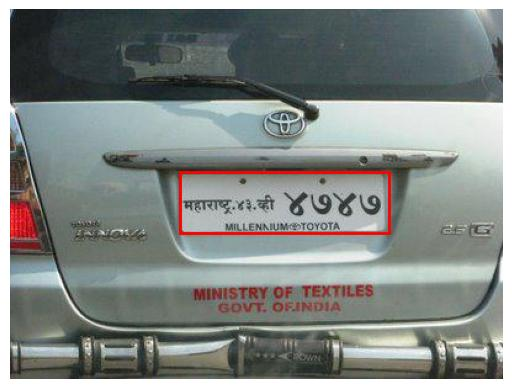
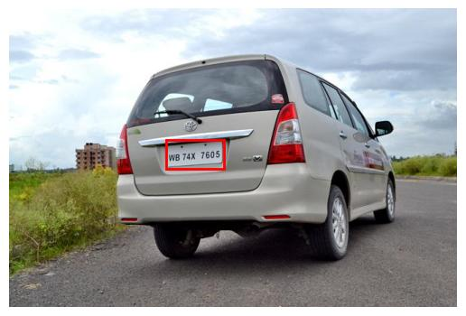
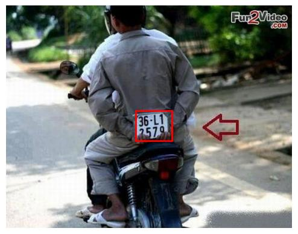
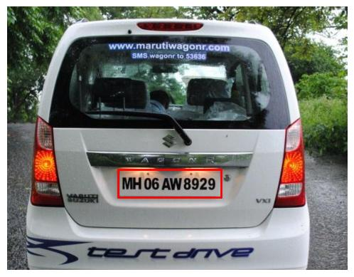
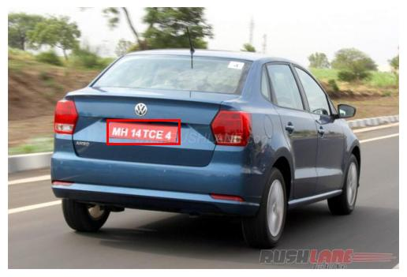
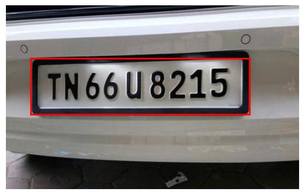
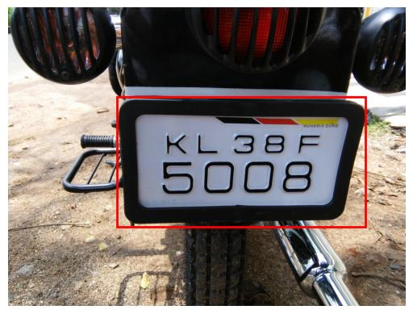
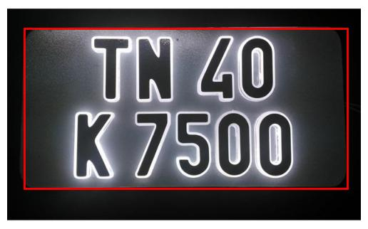
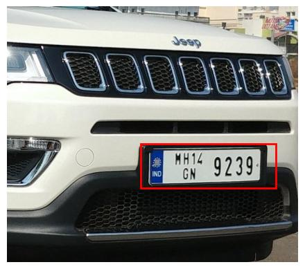
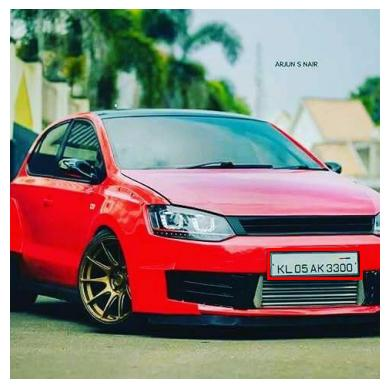
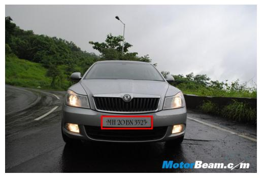
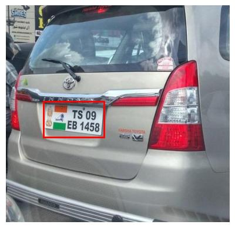

## PAGE 4 — Annotation Example
The bounding boxes in the sample images above identify the precise location of the license plate within the frame. This spatial information, converted into normalized YOLO format (x_center, y_center, width, height), serves as the ground-truth for object detection training.

## PAGE 5 — Current Status & Next Step

### COMPLETED:
- Dataset collected/obtained
- Dataset inspected
- Annotations validated
- YOLO labels prepared
- Train/validation/test split created
- Dataset quality checks performed

### NEXT PLANNED:
- Fine-tune a pretrained YOLO detector
- Evaluate detection performance
- Later add surveillance/CCTV-style data and study adaptation to that environment
